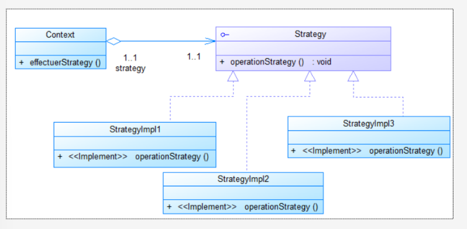
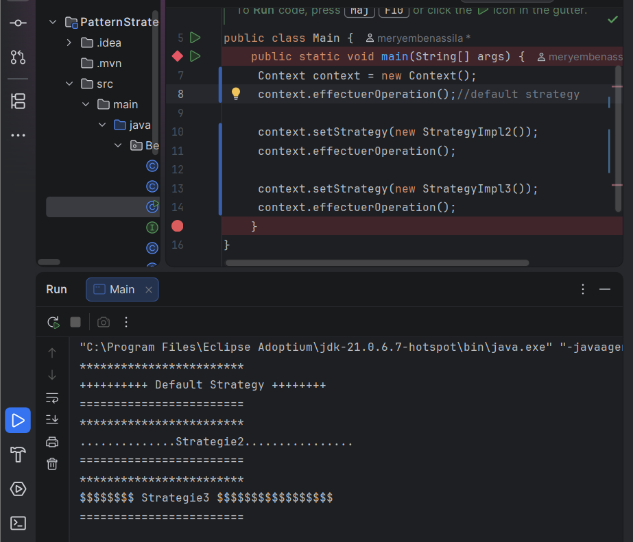
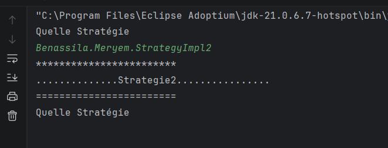
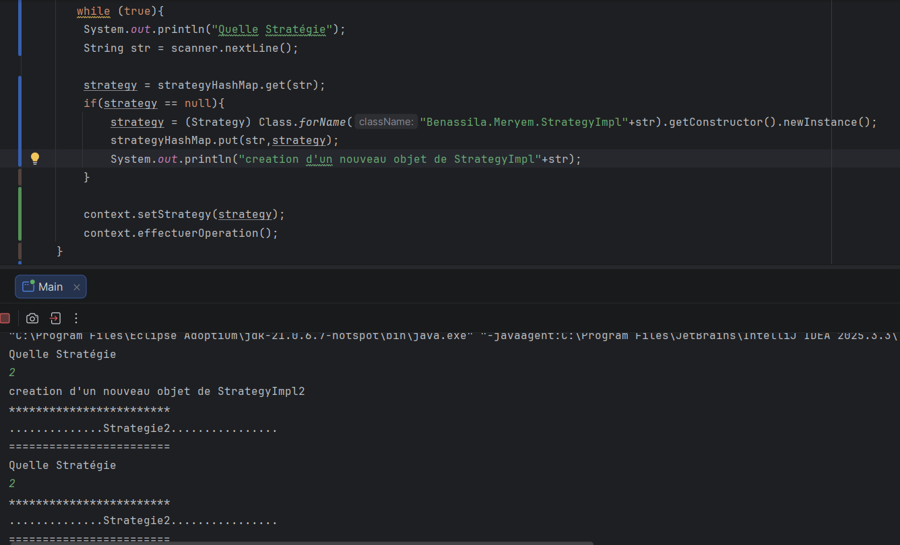

# Strategy Design Pattern

Ce projet met en pratique le **Design Pattern Strategy** en Java.

L’objectif du pattern est de permettre au **Client de choisir dynamiquement un algorithme (Strategy)** sans modifier le code du  `Context`.

## 1. Diagramme de classes

Le diagramme suivant présente la structure du **Strategy Pattern** utilisée dans le projet :

## 2. Première mise en pratique

Dans un premier test, la stratégie est choisie **manuellement par le client** puis injectée dans le `Context` à l’aide du `setter`.

Cette approche permet de changer facilement de stratégie sans modifier le `Context`.

## 3. Choix dynamique avec Scanner

Dans un deuxième test, le choix de la stratégie est effectué **dynamiquement à partir d’un `Scanner`**.

L’utilisateur saisit le nom de la stratégie à utiliser :

## 4.ajouter des bonnes pratiques 

Enfin, une **HashMap** est ajoutée afin de stocker les stratégies déjà créées.

Avant de créer une nouvelle stratégie, le programme vérifie si elle existe déjà dans la HashMap. Si elle existe, l’objet est simplement réutilisé.

